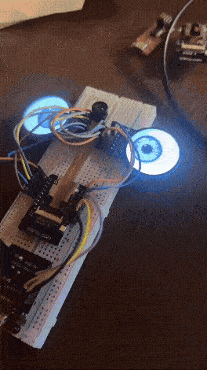
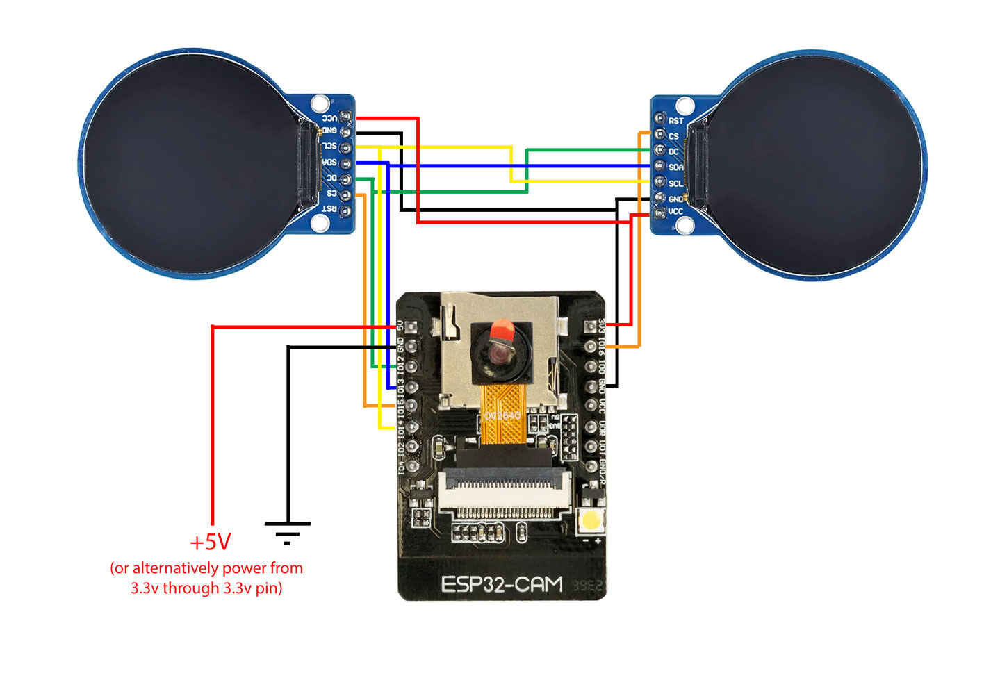

# ESP32-CAM Eyeball Tracker

A simple demo where two eyeballs, rendered on 1.28-inch round GC9A01A displays, track a light source shone into the camera lens.

### What It Is

This project uses an ESP32-CAM to perform real-time light source tracking. The firmware captures video, identifies the brightest spot in the frame, and calculates its position. This position is then used to offset an eyeball texture rendered on two separate round displays, making the eyes appear to follow the light source.

### What You'll Need

*   An ESP32-CAM board
*   2 x 1.28" GC9A01A Round TFT Displays (240x240)
*   An OV2640 Camera Module with a **120° wide-angle lens or wider**.
    > **Note:** The stock camera lens included with most ESP32-CAMs has a very narrow field of view, which severely limits the tracking effect. A wide-angle lens is strongly recommended.
*   Breadboard and jumper wires
*   A 5V power source

### How to Get Started

1.  **Wiring:** Connect the displays to your ESP32-CAM according to the schematic below. Both displays share the SCK, MOSI, and DC pins, but use separate CS (Chip Select) pins.

    

2.  **Software:**
    *   Open the project code in the Arduino IDE.
    *   Install the required libraries: `Adafruit GFX` and `Adafruit_GC9A01A`.
    *   Select "AI Thinker ESP32-CAM" from the board manager.

3.  **Upload & Run:**
    *   Connect the ESP32-CAM to your computer via a USB-to-serial adapter.
    *   Put the board into flashing mode and upload the sketch.
    *   Power up the device and shine a bright light (like a phone flashlight) at the camera to see the eyes track it.